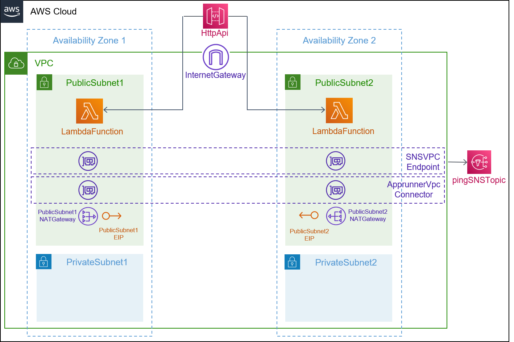

## Description

This template is compatible with the [vpc-env](../../environment-templates/vpc-env) template. It creates an Amazon API Gateway HTTP API that invokes an AWS Lambda function. The Lambda function is connect to the VPC in order to access private resources while the function is running. The function can be configured to run in a public subnet or a private subnet using the subnet_type parameter. 

## Architecture

### Public Subnet


## Parameters

### Service Inputs

1. lambda_handler: The function within your code that is called to begin execution
2. lambda_memory: The size of your Lambda functions in MB
3. lambda_timeout: The timeout in seconds of your Lambda function
4. lambda_runtime: The runtime for your Lambda service
5. code_uri: The s3 link to your application
6. subnet_type: Subnet type for your function

### Pipeline Inputs

1. code_dir: Source directory for the service
2. unit_test_command: The command to run to unit test the application code
3. packaging_command: The commands which packages your code into a file called function.zip
4. environment_account_ids: The environment account ids for service instances using cross account environment

## Test
This API Gateway service can be tested by deploying the [lambda-ping-sns](https://github.com/aws-samples/aws-proton-sample-services/tree/main/lambda-ping-sns) function that sends a random message to the shared SNS topic. Expected response when you access the HTTP API Endpoint through the browser:
```
{
  "functionName": "apigw-lambda-svc-prod-function",
  "SNS_Message": "Message cliljuwybqh sent at Thu May 05 2022 21:22:16 GMT+0000 (Coordinated Universal Time)",
  "SNS_Subject": "New message from publisher"
}
```